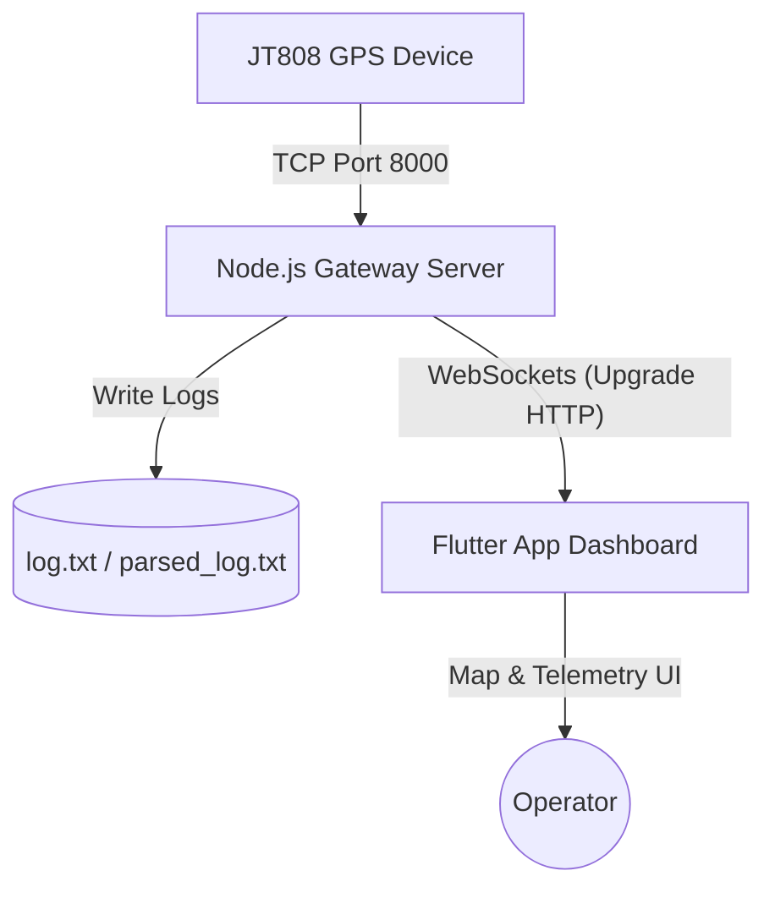

# 🌐 JT808 GPS Tracker & Real-Time Dashboard

A complete, high-performance solution for tracking GPS terminals using the **JT808 protocol**. This project includes a robust **Node.js Gateway Server** that parses TCP streams from JT808 hardware devices and broadcasts updates via WebSockets, and a premium **Flutter Mobile/Desktop Dashboard Application** that displays live device locations, status/alarm flags, and historical routes.

---

## 🏗️ Architecture Overview

The system consists of two primary components operating in harmony:



1. **JT808 Gateway Server (`server.js`)**:
   - **TCP Server (Port 8000)**: Accepts connections from GPS hardware sending JT808 protocol packets.
   - **JT808 Decoder**: Handles BCD decoding, unescaping (`0x7D` sequences), XOR checksum verification, and parses standard location reporting packets (`0x0200`).
   - **WebSocket Server (HTTP Upgrade)**: Broadcasts parsed JSON coordinates and device telemetry to active dashboard connections.
   - **MySQL Persistence**: Stores device states (`devices`), location traces (`device_history`), and message audit trails (`device_logs`) automatically.
   - **Persistent Logging**: Saves raw hex streams and parsed JSON output.

2. **Fleet Tracker Dashboard (`gps_tracker_app/`)**:
   - Built with **Flutter** (Dart), supporting cross-platform builds (Android, iOS, Web, Windows, macOS).
   - Uses `flutter_map` for rich interactive open-street map visualization.
   - Live telemetry panel displaying device-specific information (speedometer, bearing, altitude, status flags, alarm notifications).
   - Auto-follows selected devices and renders breadcrumb trails/historical routes.

---

## 🚀 Getting Started & Deployment

### 1. Prerequisite Setup

Ensure you have the following installed on your machine:

- **Node.js** (v16.0.0 or higher)
- **MySQL Database Server**
- **Flutter SDK** (v3.10.8 or higher)
- A JT808 client simulation tool (or actual hardware) to send telemetry packets to the TCP server.

---

### 2. Configure & Run the Gateway Server

The backend acts as the gateway to parse incoming TCP streams and store/broadcast them.

#### Database Configurations (Environment Variables)

The server uses environment variables to establish a MySQL connection. You can customize them or rely on defaults:

| Variable      | Description                     | Default       |
| ------------- | ------------------------------- | ------------- |
| `DB_HOST`     | Hostname of the MySQL Server    | `localhost`   |
| `DB_PORT`     | Port of the MySQL Server        | `3306`        |
| `DB_USER`     | Username to connect to MySQL    | `root`        |
| `DB_PASSWORD` | Password to connect to MySQL    | `""` (empty)  |
| `DB_NAME`     | Database to store GPS telemetry | `gps_tracker` |

_Note: The server will automatically create the database (`gps_tracker`) and the necessary tables (`devices`, `device_history`, `device_logs`) on the first startup if they do not exist._

#### Steps to Run:

1. Navigate to the project root:
   ```bash
   cd "GPS Tracker"
   ```
2. Install node dependencies:
   ```bash
   npm install
   ```
3. Configure environment variables:
   - Create a file named `.env` in the root folder (a template is available in `.env.example`).
   - Populate the variables inside `.env` with your values (e.g. `DB_HOST=127.0.0.1`, `DB_USER=root`, `DB_PASSWORD=your_password`).

4. Start the gateway server:
   ```bash
   node server.js
   ```

Upon startup, the server initializes:

- **Database Schema** (automatically creates tables).
- **TCP Port 8000** for JT808 clients/trackers.
- **HTTP Port 8000** (upgrades to WebSocket `/`) for dashboard app connections.

---

### 3. Run the Flutter App Dashboard

Ensure your device or emulator is connected.

```bash
# Navigate to the Flutter app directory
cd gps_tracker_app

# Fetch dependencies
flutter pub get

# Run the project
flutter run
```

#### Configuring the Connection

When the application opens, configure the WebSocket server address:

- If running locally: `ws://localhost:8000` or `ws://10.0.2.2:8000` (for Android emulator).
- If deployed to a remote server, input your server's IP address (e.g., `ws://your-server-ip:8000`).

---

### 4. Run the GPS Simulator

To test the system locally, you can start the simulator script. It spawns 3 moving vehicles (Red Sedan, Blue SUV, Green Delivery Van) centered around Riyadh and streams live coordinates via JT808 TCP packets:

```bash
# In a new terminal, run the simulator script
node simulator.js
```

---

## 🛠️ JT808 Protocol Implementation Details

The gateway server implements core aspects of the JT808 protocol specification:

- **Message Framing**: Packets delimited by `0x7E`.
- **Escape Character Processing**: Reverses escaping of `0x7D 0x02` to `0x7E` and `0x7D 0x01` to `0x7D`.
- **Header Parsing**: Extracting Message ID, Phone/Terminal Number (6-byte BCD representation), and Serial Number.
- **Checksum Verification**: XOR checksum validation of the payload against the trailing check byte.
- **Response Handling**: Automatically replies with standard platform general acknowledgments (`0x8001`) to the trackers to maintain connection stability.

---

## 🐳 Docker Deployment (Ubuntu Server)

To deploy the backend and database stack quickly using Docker on Ubuntu:

```bash
# 1. Clone the repository and navigate to root
git clone git@github.com:Eng-Khaled-Alhadi/GPS-Tracker.git
cd GPS-Tracker

# 2. (Optional) Customize passwords in .env
echo "DB_PASSWORD=your_secure_password" > .env

# 3. Start services with Docker Compose
docker compose up -d --build

# 4. Check status & logs
docker compose ps
docker compose logs -f gps-backend
```
